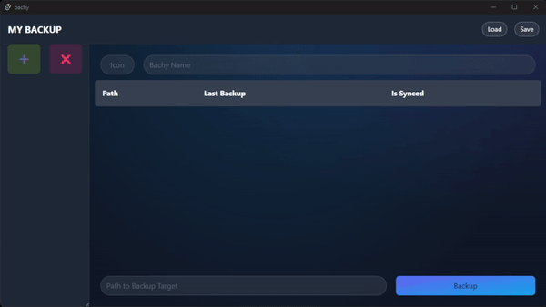

<!-- PROJECT LOGO -->
 

  

  <h3 align="center">Bachy</h3>

  

    A simple backup tool for manually backing up your data!
     
    <a href="https://github.com/Infinite24/bachy/"><strong>Explore the docs »</strong></a>
     
     
    <a href="https://github.com/Infinite24/bachy/wiki/How-to-use-the-software">View Demo</a>
    ·
    <a href="https://github.com/Infinite24/bachy/issues">Report Bug</a>
    ·
    <a href="https://github.com/Infinite24/bachy/issues">Request Feature</a>
  

  

<!-- ABOUT THE PROJECT -->
# About The Project

There are many great backup tools available. Many have complex functionality or need to always run in the background. If you prefer something simple that "just copies your files to another drive," this project is for you.
Perhaps you don't back up your data at all (by the way, you should), in which case you could use this project as a start for your backup journey!

Bachy (pronounced "backy" like in *Back*-up - the name is a joke based on a best friend's name and the german word "Bach" for stream) was created because remembering all the locations of important and backup-worthy data is difficult, and manually copying is tedious. This project is also cross-platform and should work on Windows, Linux, and macOS out of the box.

So, why should you use this project?
* You don't have any backups and do not back up your data.
* Everything else you've seen is too complex.
* You want a cross-platform solution with a nicer UI.

Why should you contribute to this project?
* The software is useful for your use case.
* You would like to learn about Rust/Svelte.
* You know what you are doing and want to help/teach others.

### Build with
[![Svelte][Svelte.dev]][Svelte-url]
[![Tailwindcss][tailwindcss.com]][tailwindcss-url]
[![Tauri][tauri.app]][tauri-url]

(<a href="#readme-top">back to top</a>)

<!-- USAGE EXAMPLES -->
# Usage and Installation
For a detailed usage guide and explanation on how to create a backup and use the software, visit the [Wiki](https://github.com/Infinite24/bachy/wiki/How-to-use-the-software).

To install the current version, visit the [releases page][repo-releases]!

Currently, there are no releases available, but version 0.0.1 will be released soon!
You can always build a release yourself.

(<a href="#readme-top">back to top</a>)

# Contribution

Feel free to contribute to this project by creating issues or pull requests.
You can also submit enhancement requests or suggest new features through issue creation, providing us with valuable ideas to shape the future of this project.

If you are a professional with expertise in Svelte or Rust, we welcome your code review and feedback.

<!-- LICENSE -->
# License
TBD. If available see `LICENSE.txt` for more information.

(<a href="#readme-top">back to top</a>)

<!-- ACKNOWLEDGMENTS -->
# Acknowledgments
* [Choose an Open Source License](https://choosealicense.com)
* [Img Shields](https://shields.io)
* [Readme Template](https://github.com/othneildrew/Best-README-Template)

(<a href="#readme-top">back to top</a>)

<!-- MARKDOWN LINKS & IMAGES -->
<!-- https://www.markdownguide.org/basic-syntax/#reference-style-links -->
[Svelte.dev]: https://img.shields.io/badge/Svelte-4A4A55?style=for-the-badge&logo=svelte&logoColor=FF3E00
[Svelte-url]: https://svelte.dev/

[tailwindcss.com]: https://img.shields.io/badge/Tailwindcss-0b1121?style=for-the-badge&logo=tailwindcss
[tailwindcss-url]: https://tailwindcss.com/

[tauri.app]: https://img.shields.io/badge/tauri-ffc131?style=for-the-badge&logo=tauri
[tauri-url]: https://tauri.app/

[repo-releases]: https://github.com/Infinite24/bachy/releases
